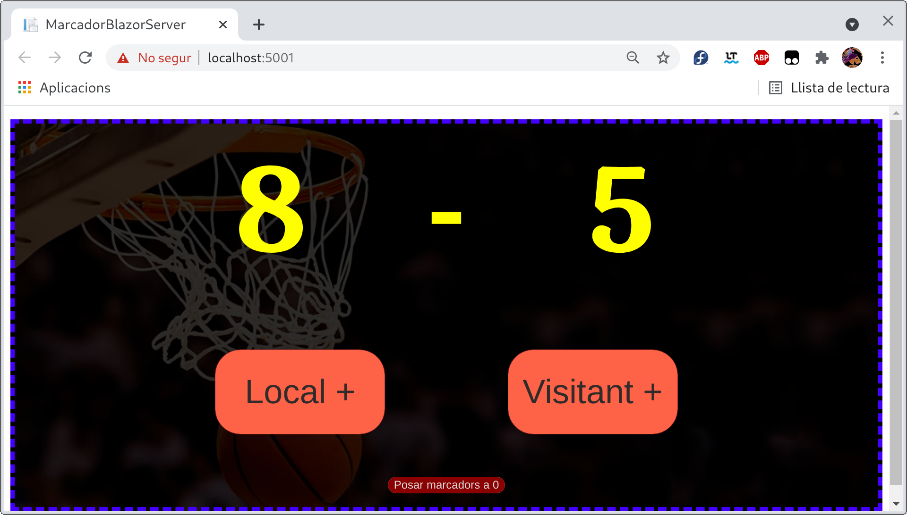

# Aplicació de demo Marcador de basketball

Construim un component per mostrar el resultat d'un marcador de basketball. El marcador es refresca de manera automàtica per a tothon.

## Components:

* MarcadorBackendDelFrontEnd.Abstracts: Interfícies pública del marcador, el component la utilitza.
* MarcadorBackendDelFrontEnd.InMemory: Implementació de la interfície del marcador.
* MarcadorBackendDelFrontEnd.Test: Testos de la implementació.
* MarcadorUI: Component blazor que mostra el marcador.
* MarcadorUI.Test: Testos del component blazor que mostra el marcador.
* MarcadorBlazorServer: Aplicació blazor server que conté el component.