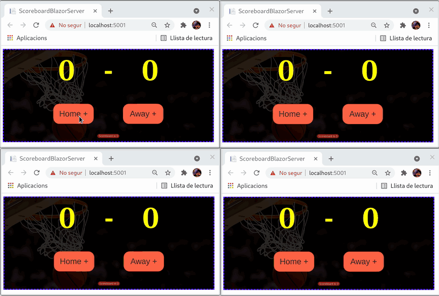

# Aplicació de demo Scoreboard de basketball

Construim un component per mostrar el resultat d'un scoreboard de basketball. El scoreboard es refresca de manera automàtica per a tothon.

## Components:

* ScoreboardService.Abstracts: Interfícies pública del scoreboard, el component la utilitza.
* ScoreboardService.InMemory: Implementació de la interfície del scoreboard.
* ScoreboardService.Test: Testos de la implementació.
* ScoreboardUI: Component blazor que mostra el scoreboard.
* ScoreboardUI.Test: Testos del component blazor que mostra el scoreboard.
* ScoreboardBlazorServer: Aplicació blazor server que conté el component.
